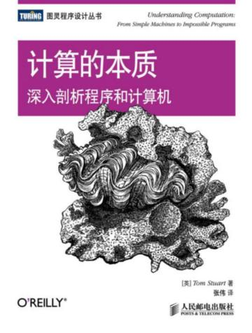

# computation

Understanding Computation From Simple Machines to Impossible Programs by Tom Stuart

作者在 [这里](https://github.com/tomstuart/computationbook) 提供了全书的完整代码。这个项目就按照自己的喜好，重新组织代码结构。

## 目录

- [小步语义](small_step): 把执行程序的复杂过程分成更小的片段
